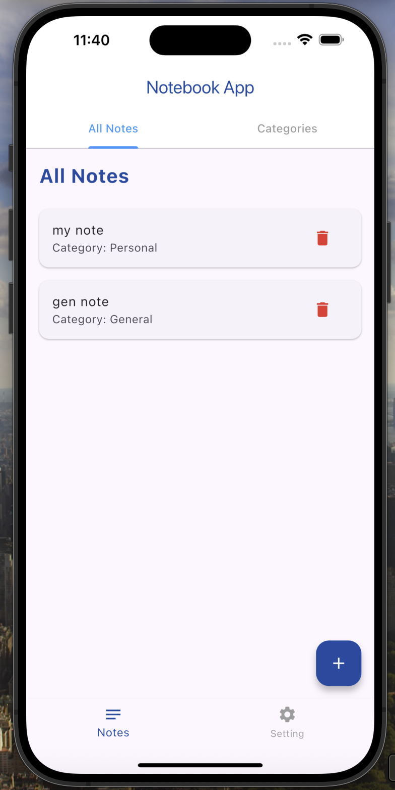
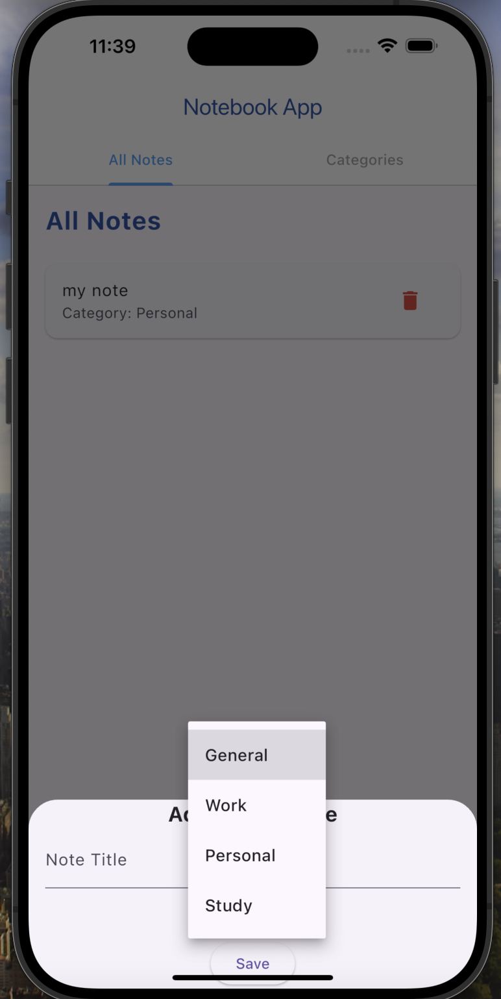

# Notebook App UI – Flutter

A clean and minimal Flutter note-taking UI that allows users to create, categorize, and delete notes easily.

<p align="center">


</p>

---

## Features

- TabBar navigation between **All Notes** and **Categories**
- Add notes with title and category
- Delete notes with a single tap
- Bottom sheet input for creating new notes
- Dropdown menu for selecting category
- Floating action button for adding notes
- Clean and minimal design

---

## Getting Started

To run the project locally:

```bash
git clone https://github.com/AinazRafiei/Flutter_Projects.git
cd Flutter_Projects/note_app_ui
flutter pub get
flutter run

note_app_ui/
├── lib/
│   ├── main.dart
│   ├── home_page.dart
│   ├── note_model.dart
│   ├── add_note_sheet.dart
├── assets/
│   └── (optional icons or fonts)
├── pubspec.yaml

